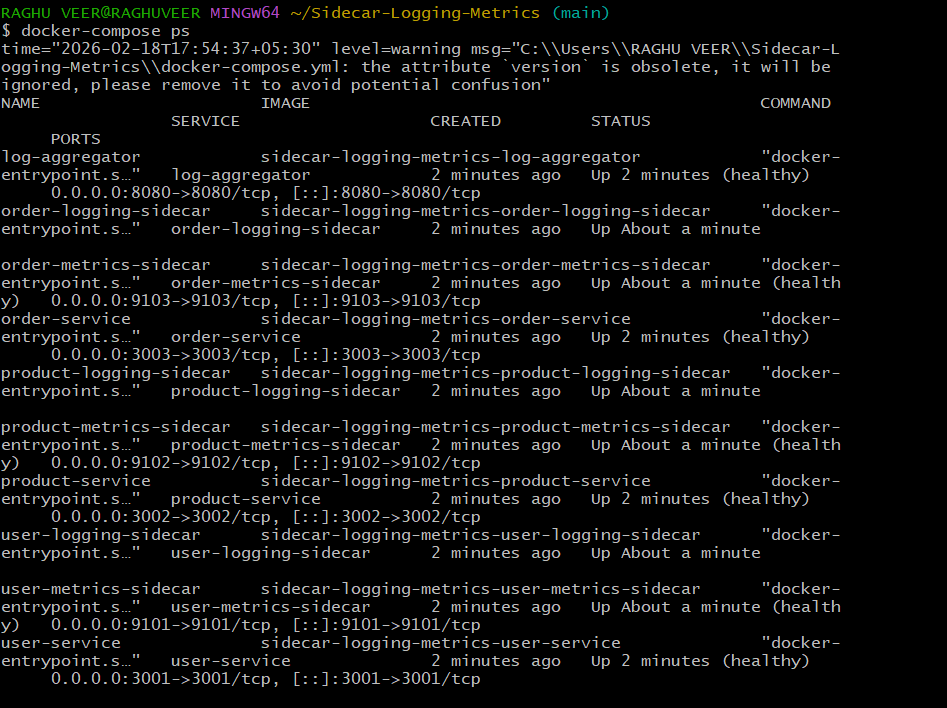
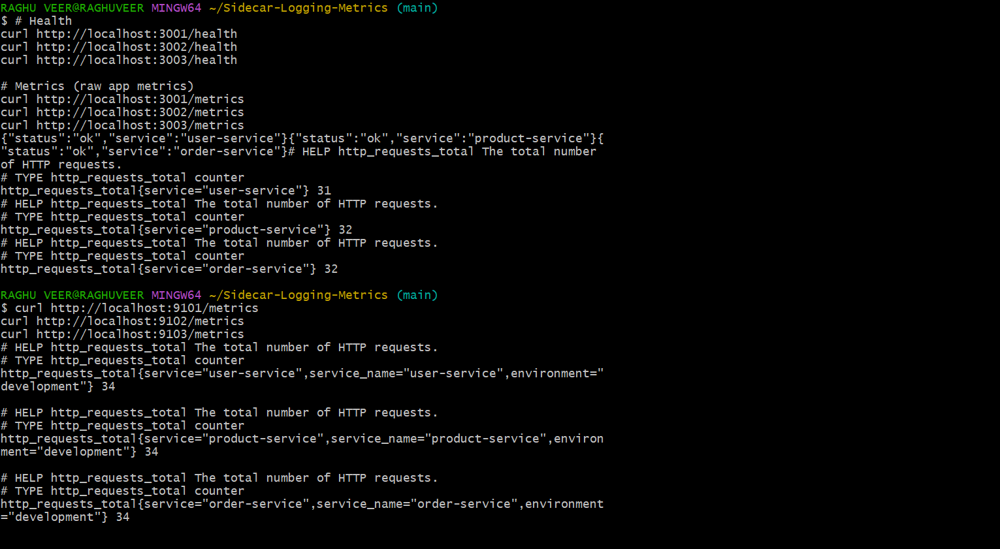

## 📌 Overview

Services included:

- user-service  
- product-service  
- order-service  

Each service has:
- Logging sidecar → reads app logs and sends them to the aggregator  
- Metrics sidecar → scrapes metrics and exposes enriched metrics  

A central **log-aggregator** collects and serves recent logs.

---

## 🧱 Architecture

- App → writes logs to `/var/log/app/app.log`
- Logging sidecar → tails log file and forwards logs
- App → exposes `/metrics`
- Metrics sidecar → scrapes and enriches metrics
- Log aggregator → stores last 10 logs and exposes API

All containers are started together with one compose file.

---

## 📂 Project Structure

```

.
├─ docker-compose.yml
├─ .env.example
├─ user-service/
├─ product-service/
├─ order-service/
├─ logging-sidecar/
├─ metrics-sidecar/
└─ log-aggregator/

````

---

## ⚙️ Prerequisites

- Docker
- Docker Compose
- Git

---

## 🚀 Setup

Clone the repository:

```bash
git clone https://github.com/lohithadamisetti123/Sidecar-Logging-Metrics.git
cd Sidecar-Logging-Metrics
````

Create environment file:

```bash
cp .env.example .env
```

---

## ▶️ Run the Stack

Build and start all services:

```bash
docker-compose up -d --build
```

Check status:

```bash
docker-compose ps
```

Stop everything:

```bash
docker-compose down
```

---

## 🔌 Service Endpoints

### Application Services

| Service         | Port | Endpoints                        |
| --------------- | ---- | -------------------------------- |
| user-service    | 3001 | `/health` `/metrics` `/users`    |
| product-service | 3002 | `/health` `/metrics` `/products` |
| order-service   | 3003 | `/health` `/metrics` `/orders`   |

Example:

```bash
curl http://localhost:3001/health
curl http://localhost:3001/metrics
```

---

### Metrics Sidecars

| Sidecar | URL                                                            |
| ------- | -------------------------------------------------------------- |
| User    | [http://localhost:9101/metrics](http://localhost:9101/metrics) |
| Product | [http://localhost:9102/metrics](http://localhost:9102/metrics) |
| Order   | [http://localhost:9103/metrics](http://localhost:9103/metrics) |

Metrics include added labels:

```
service_name
environment
```

---

### Log Aggregator

| Endpoint  | Method | Purpose           |
| --------- | ------ | ----------------- |
| `/health` | GET    | Health check      |
| `/logs`   | POST   | Receive logs      |
| `/logs`   | GET    | View last 10 logs |

Example:

```bash
curl http://localhost:8080/logs
```

---

## 🧪 Quick Verification

Generate logs:

```bash
curl http://localhost:3001/users
curl http://localhost:3002/products
curl http://localhost:3003/orders
```

Check aggregated logs:

```bash
curl http://localhost:8080/logs
```

Check enriched metrics:

```bash
curl http://localhost:9101/metrics
```

---

## 🛠 Key Features

* Sidecar-based logging per service
* Metrics scraping and enrichment
* Central log aggregation
* Prometheus-style metrics format
* Named volumes for log sharing
* Health checks for all containers

---

## 🎥 Video Walkthrough

Add your demo video link below:

```
[Watch Demo Video](https://your-video-link-here)
```

---

## 🖼 Screenshots

Place screenshots in a `/docs` folder and reference like this:

### Docker Compose Status



### Application Metrics



### Sidecar Enriched Metrics


### Aggregated Logs


---

## 🔧 Important Environment Variables

```
USER_SERVICE_PORT=3001
PRODUCT_SERVICE_PORT=3002
ORDER_SERVICE_PORT=3003

LOG_AGGREGATOR_PORT=8080
ENVIRONMENT=development

LOG_FILE_PATH=/var/log/app/app.log
```


```
```
